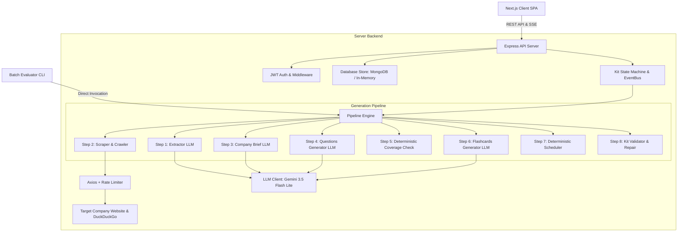

# Architecture Documentation: HLD & LLD 🏗️

This document outlines the **High-Level Design (HLD)** and **Low-Level Design (LLD)** for the **AI Interview Prep Kit Generator** application.

---

# PART I: High-Level Design (HLD)

## 1. System Overview

The system is designed as a decoupled, asynchronous, event-driven web platform and batch evaluator that transforms unformatted Job Descriptions (JDs) and company website URLs into structured, highly personalized interview prep kits.



---

## 2. Core Architectural Components

### 2.1 API Gateway & Server Layer (`server/src/routes/`)
* **Auth Routes (`/api/auth`)**: JWT-based authentication supporting register, login, logout, and session retrieval.
* **Kit Routes (`/api/kits`)**: CRUD endpoints for creating, retrieving, updating, deleting, and regenerating prep kits.
* **SSE Endpoint (`/api/kits/:id/progress`)**: Streams real-time pipeline step updates (`step 1/8`, `step 2/8`, etc.) to the client via Server-Sent Events.
* **Practice Routes (`/api/practice`)**: Flashcard practice session tracking, confidence scoring (1–5), and analytics.

### 2.2 Pipeline Engine (`server/src/services/pipeline/`)
* Built using the **Chain of Responsibility** design pattern.
* Executes discrete steps sequentially while updating a shared `KitPipelineContext`.
* Emits progress events to the `EventBus` after completing each step.

### 2.3 Web Scraper & Crawler (`server/src/services/scraper/`)
* **Fetcher (`fetcher.ts`)**: Employs per-domain rate limiting and browser User-Agent rotation.
* **Robots Validator (`robots.ts`)**: Parses `robots.txt` rules before fetching pages.
* **HTML Cleaner (`cleaner.ts`)**: Strips boilerplate tags, scripts, and navigation elements while extracting structural body text.

### 2.4 LLM Service Layer (`server/src/services/llm/`)
* **Gemini Client (`gemini.ts` / `client.ts`)**: Wraps `@google/genai` API with JSON schema enforcement, retry logic, and error handling.
* **Prompts Registry (`prompts.ts`)**: Centralized collection of structured prompts.

### 2.5 Persistence Layer (`server/src/utils/inMemoryDb.ts` & `server/src/models/Kit.ts`)
* **Primary**: MongoDB via Mongoose schemas matching Appendix A requirements.
* **Offline Fallback**: In-Memory JavaScript store activated automatically when MongoDB connection is unavailable, ensuring zero-setup execution.

---

# PART II: Low-Level Design (LLD)

## 1. Pipeline Execution Flow & Chain of Responsibility

The pipeline consists of 8 concrete steps managed by `runPipeline()` in `server/src/services/pipeline/index.ts`:

| Order | Step Class | Critical | Description |
|---|---|---|---|
| **1** | `ExtractRequirementsStep` | Yes | Calls LLM to extract requirements, role title, seniority, and location from raw `jdText`. |
| **2** | `ResearchCompanyStep` | No | Crawls target company website and fetches public interview discussions. |
| **3** | `GenerateCompanyBriefStep` | No | Summarizes company mission, products, and culture into a 2-3 sentence overview. |
| **4** | `GenerateQuestionsStep` | Yes | Generates questions for Technical, Behavioural, System Design, and Company Fit categories. |
| **5** | `CheckCoverageAndFillGapsStep` | No | Runs deterministic coverage check. If uncovered requirement IDs exist, triggers LLM gap filling loop. |
| **6** | `GenerateFlashcardsStep` | No | Generates flashcards for technical terms and concepts linked to requirement IDs. |
| **7** | `BuildScheduleStep` | No | Executes deterministic algorithm allocating questions across study days. |
| **8** | `AssembleKitStep` | No | Repairs missing fields, validates kit against schema, and saves to database. |

---

## 2. Low-Level Algorithms

### 2.1 Multi-Key Resilient Requirement Extraction (`extractor.ts`)
To safeguard against LLM JSON schema variations, `extractRequirements` implements a harvester scanning 12 candidate field names:

```typescript
const candidateKeys = [
  'requirements', 'skills', 'must_haves', 'must_have',
  'nice_to_haves', 'nice_to_have', 'qualifications',
  'key_requirements', 'technical_skills', 'soft_skills',
  'items', 'extracted_requirements'
];
```
* **Fallback Strategy**: If total extracted requirements equal `0`, the algorithm automatically splits `jdText` by bullet points (`•`, `-`, `*`) or sentences to generate 5–8 fallback requirements directly from the text.

---

### 2.2 Deterministic Coverage Gap Checker (`coverage.ts`)

Given extracted requirement IDs $R = \{r_1, r_2, \dots, r_n\}$ and questions $Q$, a requirement $r_i$ is covered if:

$$\exists q \in Q \quad \text{such that} \quad r_i \in q.\text{requirement\_ids}$$

If any requirement in $R$ lacks coverage, the system enters a multi-pass gap filling loop up to `maxPasses = 3`.

---

### 2.3 Difficulty-Weighted Study Schedule Allocator (`scheduler.ts`)

Allocates study time into integer minute budgets across available days $D$:

1. **Calculate Question Weight**:
   $$W(q) = \text{difficulty}(q) \times (\text{category} == \text{'technical'} ? 1.5 : 1.0)$$

2. **Daily Time Budget**:
   $$\text{Minutes}(d) = \left\lfloor \frac{\sum W(q_d)}{\sum W(Q)} \times (D \times 60) \right\rfloor$$

3. **Remainder Distribution**: Any rounding discrepancy between total assigned minutes and $(D \times 60)$ is added to the day with the largest workload, ensuring exact integer budget consistency.

---

## 3. Data Schema Specifications (Appendix A Compliant)

Every prep kit document conforms to the following TypeScript interface:

```typescript
interface Kit {
  _id: string;
  source: {
    company: string;
    company_url: string;
    role: string;
    location: string;
    jd_chars: number;
    researched_at: string;
    pages_used: string[];
  };
  company_brief: {
    summary: string;
    what_they_do: string;
    sources: string[];
  };
  role: {
    title: string;
    seniority: string;
    responsibilities: string[];
    requirements: Array<{
      id: string;
      text: string;
      kind: 'technical' | 'behavioural' | 'domain';
      priority: 'must' | 'nice';
    }>;
  };
  questions: Array<{
    id: string;
    requirement_ids: string[];
    category: 'technical' | 'behavioural' | 'system-design' | 'company-fit';
    prompt: string;
    answer_outline: string;
    difficulty: number;
    _state?: 'generated' | 'edited' | 'user_created';
  }>;
  flashcards: Array<{
    id: string;
    front: string;
    back: string;
    requirement_ids: string[];
    _state?: 'generated' | 'edited' | 'user_created';
  }>;
  schedule: {
    days_available: number;
    days: Array<{
      day: number;
      focus: string;
      question_ids: string[];
      minutes: number;
    }>;
  };
  coverage: {
    uncovered_requirement_ids: string[];
    passes: number;
  };
}
```
